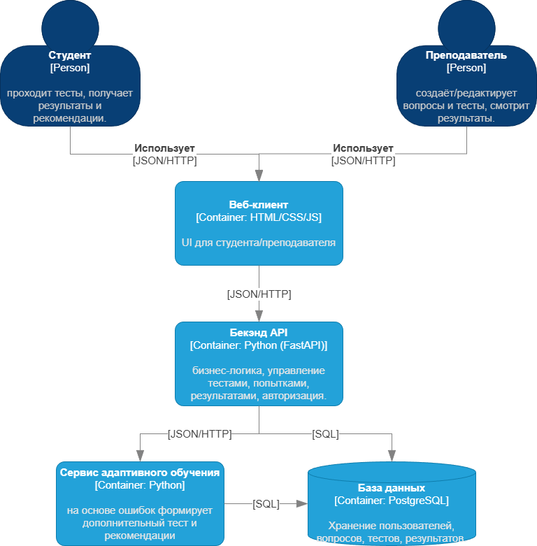
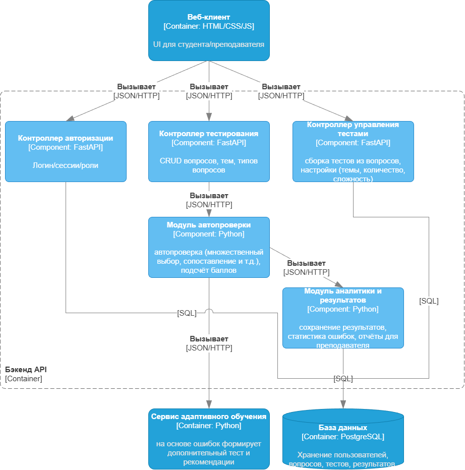
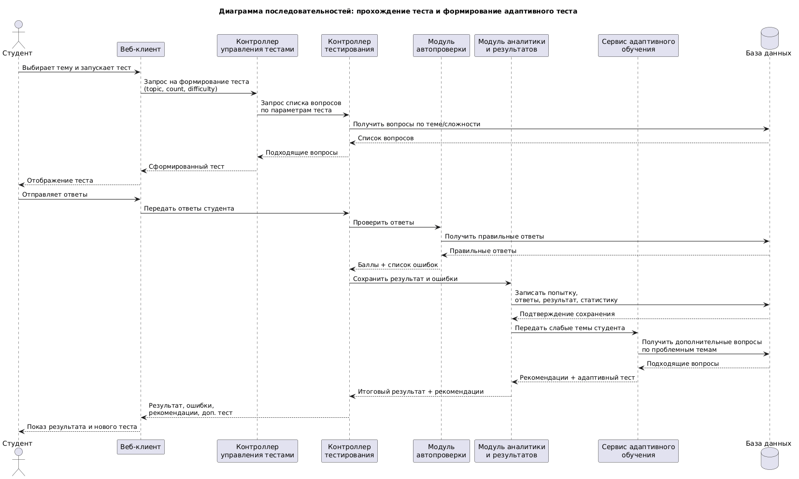

# Лабораторная работа №3
**Тема**: Использование принципов проектирования на уровне методов и классов. 
**Цель работы**: Получить опыт проектирования и реализации модулей с использованием принципов KISS, YAGNI, DRY, SOLID и др.
# Диаграмма контейнеров
Выбран базовый архитектурный стиль: слоистая веб-архитектура: Frontend → Backend API → База данных. Самый подходящий и понятный вариант для веб-системы тестирования, обеспечивает разделение ответственности и значительно упрощает разработку.



- Веб-клиент — пользовательский интерфейс для студента и преподавателя.
- Бэкенд API (FastAPI) — точка входа для веб-клиента, реализует бизнес-логику, авторизацию, управление тестами и результатами.
- Сервис адаптивного обучения — формирует дополнительные тесты и рекомендации на основе ошибок.
- База данных (PostgreSQL) — хранит пользователей, вопросы, тесты, попытки и результаты.
# Диаграмма компонентов
Для диаграммы компонентов был выбран Бэкенд-апи контейнер.


- Контроллер авторизации — логин/сессии/роли пользователей.
- Контроллер тестирования — CRUD вопросов, тем и типов вопросов.
- Контроллер управления тестами — сборка тестов из вопросов, настройки (темы, количество, сложность).
- Модуль автопроверки — автоматическая проверка ответов и подсчёт баллов.
- Модуль аналитики и результатов — сохранение результатов, статистика ошибок, отчёты для преподавателя.
- Сервис адаптивного обучения — вызывается для формирования доп. теста и рекомендаций.

# Диаграмма последовательности
Сценарий:
- Студент на веб-клиенте выбирает тему и запускает тест.
- Веб-клиент отправляет запрос на формирование теста.
- Контроллер управления тестами получает параметры теста и запрашивает вопросы.
- Контроллер тестирования получает вопросы из БД.
- Сформированный тест возвращается студенту.
- Студент отвечает на вопросы и отправляет ответы.
- Контроллер тестирования передает ответы в модуль автопроверки.
- Модуль автопроверки сравнивает ответы с правильными, считает баллы и определяет ошибки.
- Результаты передаются в модуль аналитики.
- Модуль аналитики сохраняет результат в БД и определяет слабые темы.
- На основе слабых тем вызывается сервис адаптивного обучения.
- Сервис адаптивного обучения формирует рекомендации и дополнительный тест.
- Итоговый результат, рекомендации и дополнительный тест возвращаются студенту.



# Модель БД
Описание модели базы данных.


Role - Хранит роли пользователей системы.

| Поле   | Описание                                                                       |
| ------ | ------------------------------------------------------------------------------ |
| `id`   | Уникальный идентификатор роли. Первичный ключ таблицы.                         |
| `name` | Название роли пользователя в системе. Например: `student`, `teacher`, `admin`. |


User - Хранит данные пользователей системы.

| Поле            | Описание                                                                      |
| --------------- | ----------------------------------------------------------------------------- |
| `id`            | Уникальный идентификатор пользователя. Первичный ключ.                        |
| `full_name`     | Полное имя пользователя. Используется для отображения в интерфейсе и отчетах. |
| `email`         | Электронная почта пользователя. Используется как логин и средство связи.      |
| `password_hash` | Хэш пароля пользователя. Нужен для безопасной аутентификации.                 |
| `role_id`       | Внешний ключ на таблицу `Role`. Определяет права доступа пользователя.        |

Topic - Хранит учебные темы по биологии.

| Поле          | Описание                                                             |
| ------------- | -------------------------------------------------------------------- |
| `id`          | Уникальный идентификатор темы. Первичный ключ.                       |
| `title`       | Название учебной темы. Например: «Генетика», «Ботаника», «Зоология». |
| `description` | Краткое описание темы или пояснение по ее содержанию.                |

Question - Хранит вопросы для тестирования.

| Поле            | Описание                                                                                 |
| --------------- | ---------------------------------------------------------------------------------------- |
| `id`            | Уникальный идентификатор вопроса. Первичный ключ.                                        |
| `topic_id`      | Внешний ключ на таблицу `Topic`. Показывает, к какой теме относится вопрос.              |
| `text`          | Текст вопроса, который будет отображаться студенту.                                      |
| `question_type` | Тип вопроса. Например: один правильный ответ, множественный выбор, текстовый ответ.      |
| `difficulty`    | Уровень сложности вопроса. Может использоваться при подборе обычных и адаптивных тестов. |

AnswerOption - Хранит варианты ответа для вопросов закрытого типа.

| Поле          | Описание                                                                           |
| ------------- | ---------------------------------------------------------------------------------- |
| `id`          | Уникальный идентификатор варианта ответа. Первичный ключ.                          |
| `question_id` | Внешний ключ на таблицу `Question`. Указывает, к какому вопросу относится вариант. |
| `text`        | Текст варианта ответа.                                                             |
| `is_correct`  | Признак правильности варианта ответа. `true` — правильный, `false` — неправильный. |


Test - Хранит информацию о тестах.

| Поле          | Описание                                                                                         |
| ------------- | ------------------------------------------------------------------------------------------------ |
| `id`          | Уникальный идентификатор теста. Первичный ключ.                                                  |
| `title`       | Название теста. Например: «Промежуточный тест по генетике».                                      |
| `topic_id`    | Внешний ключ на таблицу `Topic`. Показывает, по какой теме создан тест.                          |
| `created_by`  | Внешний ключ на таблицу `User`. Указывает, кто создал тест, обычно преподаватель.                |
| `is_adaptive` | Признак адаптивного теста. Если `true`, тест был сформирован системой на основе ошибок студента. |
| `created_at`  | Дата и время создания теста.                                                                     |

TestQuestion - Связующая таблица между тестами и вопросами.

| Поле          | Описание                                                                                         |
| ------------- | ------------------------------------------------------------------------------------------------ |
| `id`          | Уникальный идентификатор записи. Первичный ключ.                                                 |
| `test_id`     | Внешний ключ на таблицу `Test`. Показывает, к какому тесту относится вопрос.                     |
| `question_id` | Внешний ключ на таблицу `Question`. Указывает, какой вопрос включен в тест.                      |
| `order_no`    | Порядковый номер вопроса в тесте. Нужен для правильного отображения последовательности вопросов. |
| `points`      | Количество баллов, которое можно получить за правильный ответ на данный вопрос.                  |

Attempt - Хранит информацию о попытках прохождения теста студентами.

| Поле           | Описание                                                                  |
| -------------- | ------------------------------------------------------------------------- |
| `id`           | Уникальный идентификатор попытки. Первичный ключ.                         |
| `student_id`   | Внешний ключ на таблицу `User`. Указывает, какой студент проходил тест.   |
| `test_id`      | Внешний ключ на таблицу `Test`. Показывает, какой именно тест проходился. |
| `started_at`   | Дата и время начала попытки.                                              |
| `completed_at` | Дата и время завершения попытки.                                          |
| `score`        | Итоговый балл или процент, полученный студентом за тест.                  |

StudentAnswer - Хранит ответы студента на вопросы в рамках одной попытки.

| Поле             | Описание                                                                       |
| ---------------- | ------------------------------------------------------------------------------ |
| `id`             | Уникальный идентификатор ответа студента. Первичный ключ.                      |
| `attempt_id`     | Внешний ключ на таблицу `Attempt`. Указывает, к какой попытке относится ответ. |
| `question_id`    | Внешний ключ на таблицу `Question`. Показывает, на какой вопрос был дан ответ. |
| `text_answer`    | Текстовый ответ студента. Используется для открытых вопросов.                  |
| `is_correct`     | Признак правильности ответа после проверки системой.                           |
| `awarded_points` | Количество баллов, начисленных студенту за данный ответ.                       |

StudentAnswerOption - Хранит выбранные студентом варианты ответа.

| Поле                | Описание                                                                                                  |
| ------------------- | --------------------------------------------------------------------------------------------------------- |
| `id`                | Уникальный идентификатор записи. Первичный ключ.                                                          |
| `student_answer_id` | Внешний ключ на таблицу `StudentAnswer`. Указывает, к какому ответу студента относится выбранный вариант. |
| `answer_option_id`  | Внешний ключ на таблицу `AnswerOption`. Показывает, какой вариант был выбран студентом.                   |

Recommendation - Хранит рекомендации для студента по результатам тестирования.

| Поле         | Описание                                                                                                     |
| ------------ | ------------------------------------------------------------------------------------------------------------ |
| `id`         | Уникальный идентификатор рекомендации. Первичный ключ.                                                       |
| `student_id` | Внешний ключ на таблицу `User`. Показывает, для какого студента сформирована рекомендация.                   |
| `topic_id`   | Внешний ключ на таблицу `Topic`. Указывает, по какой теме была выявлена проблема.                            |
| `attempt_id` | Внешний ключ на таблицу `Attempt`. Связывает рекомендацию с конкретной попыткой тестирования.                |
| `text`       | Текст рекомендации. Например: совет повторить тему, пройти дополнительный тест, изучить определенный раздел. |
| `created_at` | Дата и время формирования рекомендации.                                                                      |

# Применение основных принципов разработки

## Принцип KISS
KISS (Keep It Simple, Stupid) означает, что решение должно быть максимально простым и понятным, без лишнего усложнения.

В данной работе принцип KISS можно учесть при реализации проверки ответов. Вместо сложной иерархии классов для базового сценария используется простая функция сравнения ответа пользователя с правильным вариантом.
```python
def check_single_choice(correct_option_id: int, selected_option_id: int) -> bool:
    return correct_option_id == selected_option_id


def calculate_score(results: list[bool]) -> int:
    score = 0
    for is_correct in results:
        if is_correct:
            score += 1
    return score
```

## Принцип YAGNI
YAGNI (You Aren’t Gonna Need It) означает, что не следует реализовывать функциональность заранее, если в текущей версии системы она не требуется.

При разработке системы адаптивного тестирования можно не внедрять сложные механизмы, достаточно реализовать адаптивность на основе простого правила: если студент допускает ошибки по определённой теме, система формирует рекомендации и дополнительный тест именно по этой теме.

```python
def get_weak_topics(answer_stats: list[dict]) -> list[int]:
    weak_topics = []

    for stat in answer_stats:
        if stat["correct_answers"] / stat["total_answers"] < 0.6:
            weak_topics.append(stat["topic_id"])

    return weak_topics
```
## Принцип DRY
DRY (Don’t Repeat Yourself) означает, что одинаковая логика не должна дублироваться в разных местах программы.

В системе этот принцип может быть учётен при вынесении повторяющихся операций в отдельные функции и сервисы. Например, получение вопросов по теме и сложности используется как при обычном тестировании, так и при формировании адаптивного теста.

```python
class QuestionRepository:
    def __init__(self, db):
        self.db = db

    def get_questions_by_topic(self, topic_id: int, limit: int):
        return (
            self.db.query(Question)
            .filter(Question.topic_id == topic_id)
            .limit(limit)
            .all()
        )
```

```python
class TestService:
    def __init__(self, question_repository: QuestionRepository):
        self.question_repository = question_repository

    def create_test(self, topic_id: int, question_count: int):
        questions = self.question_repository.get_questions_by_topic(
            topic_id=topic_id,
            limit=question_count
        )
        return questions
```

```python
class AdaptiveLearningService:
    def __init__(self, question_repository: QuestionRepository):
        self.question_repository = question_repository

    def create_adaptive_test(self, weak_topic_id: int, question_count: int):
        return self.question_repository.get_questions_by_topic(
            topic_id=weak_topic_id,
            limit=question_count
        )
```
## Принцип SOLID
Single Responsibility Principle - Принцип единственной ответственности означает, что каждый класс должен отвечать только за одну задачу.

Класс EvaluationService занимается только проверкой ответов и подсчётом результата.
Он не отвечает за авторизацию, сохранение данных или генерацию рекомендаций. Это соответствует принципу единственной ответственности.

```python
class EvaluationService:
    def __init__(self, question_repository):
        self.question_repository = question_repository

    def evaluate(self, answers: list[dict]) -> dict:
        results = []
        for answer in answers:
            correct_option_id = self.question_repository.get_correct_option_id(
                answer["question_id"]
            )
            is_correct = correct_option_id == answer["selected_option_id"]
            results.append(is_correct)

        return {
            "score": sum(results),
            "results": results
        }
```

Open/Closed Principle - Принцип открытости/закрытости означает, что система должна быть открыта для расширения, но закрыта для изменения существующего кода.

Если в системе появится новый тип вопроса, например текстовый ответ, можно будет добавить новый класс TextAnswerChecker, не изменяя уже написанные классы.


```python
from abc import ABC, abstractmethod

class AnswerChecker(ABC):
    @abstractmethod
    def check(self, correct_answer, user_answer) -> bool:
        pass


class SingleChoiceChecker(AnswerChecker):
    def check(self, correct_answer, user_answer) -> bool:
        return correct_answer == user_answer


class MultipleChoiceChecker(AnswerChecker):
    def check(self, correct_answer, user_answer) -> bool:
        return set(correct_answer) == set(user_answer)
```

Liskov Substitution Principle - Принцип подстановки Барбары Лисков означает, что объекты дочерних классов должны корректно заменять объекты базового класса.

Функция evaluate_answer не зависит от конкретной реализации.
Она работает с любым объектом, который реализует интерфейс AnswerChecker.
Это и есть реализация принципа подстановки.

```python
def evaluate_answer(checker: AnswerChecker, correct_answer, user_answer) -> bool:
    return checker.check(correct_answer, user_answer)


single_checker = SingleChoiceChecker()
multiple_checker = MultipleChoiceChecker()

result1 = evaluate_answer(single_checker, 2, 2)
result2 = evaluate_answer(multiple_checker, [1, 3], [3, 1])
```

Interface Segregation Principle - Принцип разделения интерфейсов означает, что не следует заставлять класс реализовывать методы, которые ему не нужны.
Вместо одного большого интерфейса для всей системы лучше использовать небольшие специализированные интерфейсы.

Компонент, который отвечает только за выдачу вопросов, не обязан реализовывать сохранение результатов, и наоборот.


```python
from abc import ABC, abstractmethod

class TestProvider(ABC):
    @abstractmethod
    def get_test_questions(self, topic_id: int, count: int):
        pass


class ResultSaver(ABC):
    @abstractmethod
    def save_result(self, student_id: int, test_id: int, score: int):
        pass
```

Dependency Inversion Principle - Принцип инверсии зависимостей означает, что высокоуровневые модули не должны зависеть от низкоуровневых, оба должны зависеть от абстракций.

EvaluationService зависит не от конкретной реализации работы с БД, а от абстракции QuestionRepositoryInterface.


```python
class EvaluationService:
    def __init__(self, question_repository: QuestionRepositoryInterface):
        self.question_repository = question_repository
```


